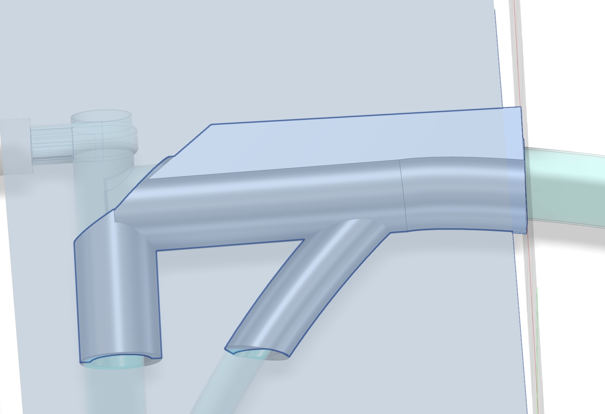
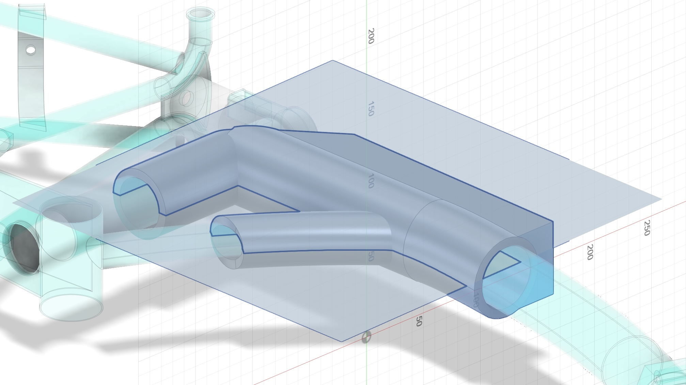
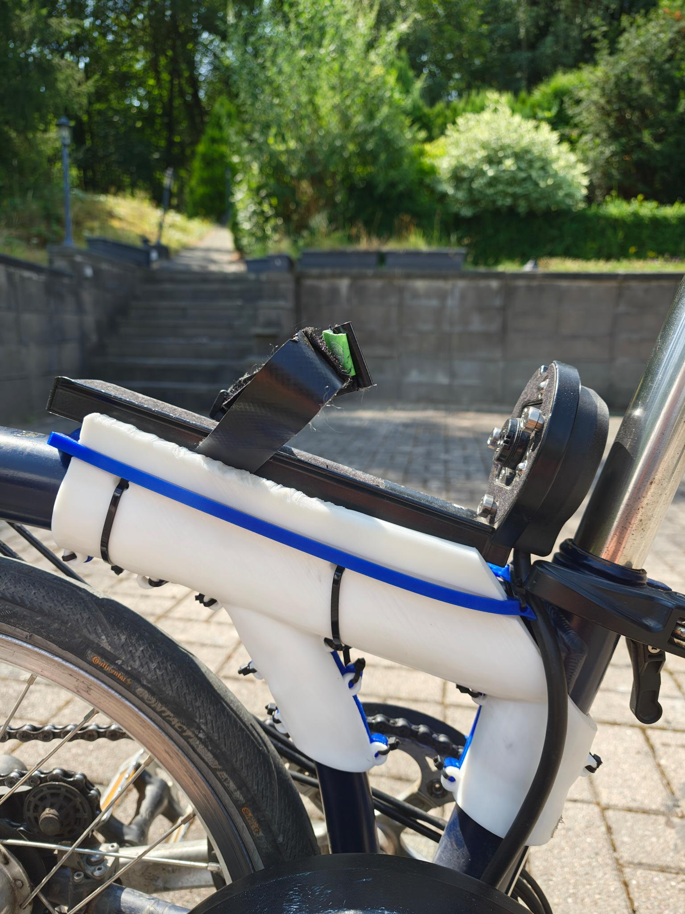
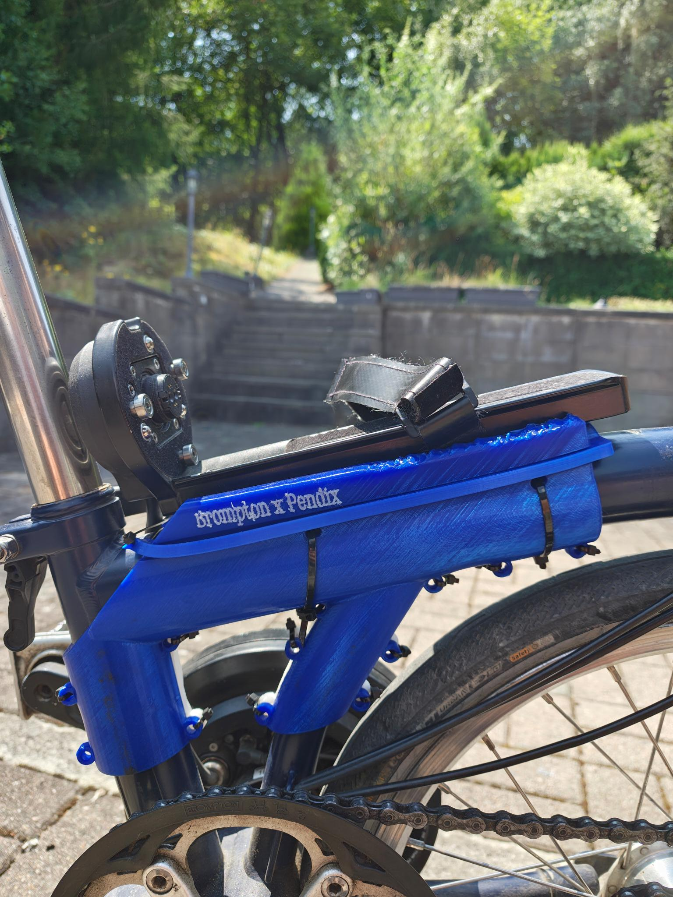
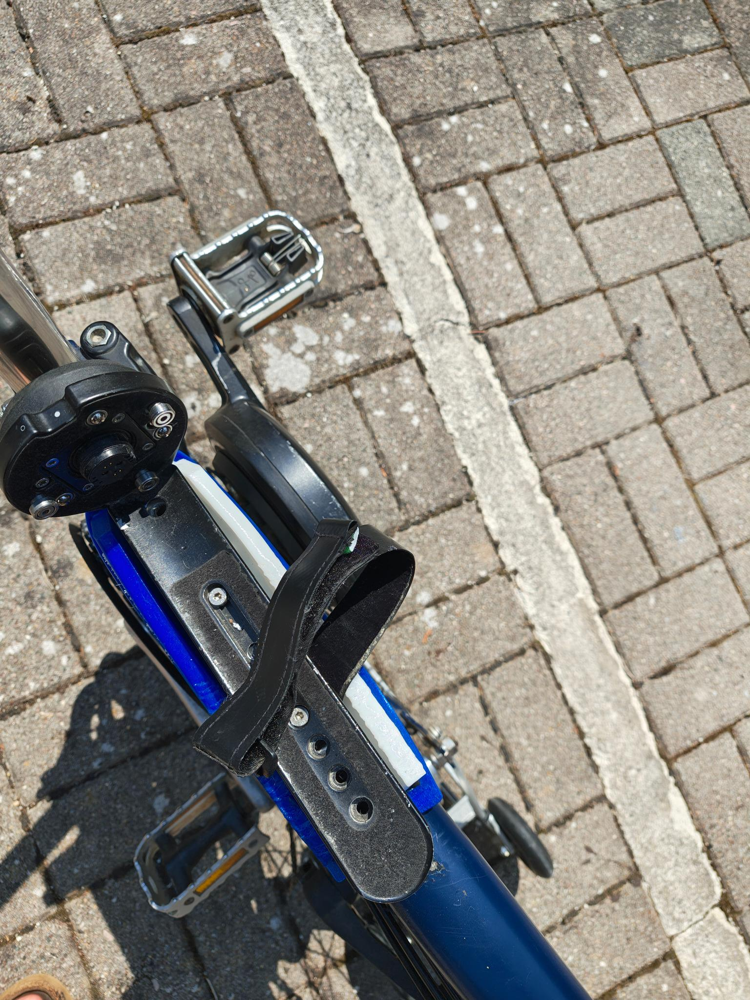

# Brompton 3D Printing Parts

A collection of 3D-printed parts designed for the Brompton folding bike (with a Pendix mid-drive conversion). Each part lives in its own folder with source CAD/print files and a `pics/` gallery.

> **Status:** first-attempt prototypes, both currently in use. TODOs below mark things I'll refine after more riding experience.

## Parts

- [Stem Bag Holder](#stem-bag-holder) — second support point for a stem/handlebar bag, using a printed bearing collar
- [Triangle Clamp for Pendix](#triangle-clamp-for-pendix) — anti-rotation bracket for the Pendix battery holder

---

## Stem Bag Holder

**Folder:** [`stem-bag-holder/`](stem-bag-holder/)

The brompton luggage carrier block offers a great way to secure front bags. If bags grow tall or are the weight limit offroad, this single attachment point may caus issues. This part adds a second support: a collar clamped around the bike's stem, with printed tabs that bungee cords loop through to tie the bag down and reduce wobble.

The stem turns with the handlebars during steering, so the collar can't just grip it rigidly — a printed [dumbbell/ball bearing](stem-bag-holder/pics/slicer-exploded-1.jpg) is embedded in the collar, letting the outer clamp stay fixed to the frame while the inner ring rotates freely with the stem.

This is an OrcaSlicer edit based on: [Bearing Generator - Parametric Ball Bearings](https://makerworld.com/en/models/1083205-bearing-generator-parametric-ball-bearings#profileId-1075444) on MakerWorld.

> **No files included here.** The bearing generator's license doesn't permit sharing derivative digital/physical files, so the `.3mf` isn't in this repo. Generate the bearing yourself on the MakerWorld page (steps below) and apply the slicer edits described to reproduce this part.

**How to reproduce:**

1. On the [MakerWorld model page](https://makerworld.com/en/models/1083205-bearing-generator-parametric-ball-bearings#profileId-1075444), open **Customize**.
2. Under **Bearing → Type**, select **Custom**.
3. Set **Ball** to **Dumbbell**.
4. Under the **Custom** tab, set:
   - Inner Diameter: `35.2`
   - Outer Diameter: `62.0`
   - Width: `30.0`
   - Spacing: `0.05`
   - Clearance: `0.15`
   - Chamfer: `0.6`
5. Click **Generate**, then export/download the model and import it into OrcaSlicer or Bambu Studio (menu paths below match OrcaSlicer 2.x / Bambu Studio — layouts are nearly identical between the two; slightly different wording in other versions).

**Slicer edits (OrcaSlicer / Bambu Studio):**

1. **Split the bearing into its parts.** Right-click the model in the 3D view (or in the object list on the right) → **Split to objects**. This separates the outer ring, inner ring, and balls into independent objects.
2. **Cut each ring in half.** Select the outer ring → click the **Cut** tool in the left toolbar (box icon with dashed line / knife icon, shortcut `C`). Drag the cutting plane to 90degree, make sure **"Place on cut"** is off if you want both halves kept separately, then confirm. Repeat for the inner ring.
3. **Add the mounting blocks.** Right-click empty space on the build plate → **Add primitive → Cube**. Use the **Move**/**Scale**/**Rotate** tools (left toolbar) to position one block at the 3 o'clock, one at 6 o'clock, and one at 9 o'clock position around the outer ring half, flush against the ring wall.
4. **Punch the zip-tie and bungee holes.** For each hole:
   - Right-click empty space → **Add primitive → Cylinder**, size and position it where the hole should go.
   - In the object list, right-click that cylinder sub-part → set its type to **Negative part** (this subtracts it from the block it overlaps instead of printing as solid).
   - 3 and 9 o'clock blocks: one negative cylinder (zip tie) plus a half-cylinder shape (bungee guide groove) cut into the outer face — model the half-cylinder as a cylinder primitive sunk halfway into the block, also set to **Negative part**.
   - 6 o'clock block: same half-cylinder bungee guide (block made smaller), plus two negative cylinders — one through the top, one through the bottom — for a zip tie to clamp the bungee in place.
5. **Assign the inner ring's material.** Since the inner ring is a separate object, select it in the object list and use the small filament/extruder dropdown next to its name to assign it to your TPU 95A filament slot (outer collar keeps the default/PETG slot). This is what "painting a color" onto an object does in the object list — it's really an extruder assignment, not a cosmetic color.
6. Arrange, slice, and print as usual.

**Print notes:**
- Outer collar (PETG shell) + inner ring facing the stem (TPU 95A) — the softer TPU protects the stem finish and cushions the bearing action.
- 5 walls / giroid infill 25%
- First print. May be tweaked

**Good Enough vs. Nice:**
- It is currently held by zipties. Insets for screws would be nice
- It is a simple slicer edit. Nice would be a 3d model, that has the right angles and attachements of the bungee cord. Also this would prevent snagging of the cables

### Gallery

| | |
|---|---|
|  |  |
|  |  |
|  |  |

---

## Triangle Clamp for Pendix

**Folder:** [`triangle-clamp-for-pendix/`](triangle-clamp-for-pendix/)

The Pendix mid-drive battery holder is normally just strapped to the main tube, which lets it twist left/right under load. This two-piece bracket clamps around the main tube next to the motor to stop that lateral rotation, holding the battery pack steady.

Based on / adapted from the [Brompton B75 clamp](https://grabcad.com/library/brompton-b75-1) on GrabCAD — credit to the original designer.

**Files:**
- `Pendix Bracket.f3d` / `Pendix Bracket.step` — source CAD (Fusion 360)
- `Pendix BracketL-20260712-1.3mf` — left-side print file
- `pendix-bracket-R_20260713-1.3mf` — right-side print file

**Print notes:**
- Printed in TPU 72D on both sides. Ran out of blue filament partway through, hence the two-tone left/right in the photos.
- 5 Walls, Giroid Infill 25%

**Good Enough vs. Nice:**
- First attempt — works, but I'd like it a bit more rigid while keeping the non-brittle behavior TPU gives over something like PETG/ASA.
- the clerances are not exactly right. Need to check if it's material calibration, the model or my bike being slightly different then the cad model.
### Gallery

| | |
|---|---|
|  |  |
|  |  |
|  | |

---

## License / Credits

Everything in this repo that I created (README, photos, print notes, the Fusion 360 source for the Pendix bracket) is released under **[CC0 1.0 Universal](https://creativecommons.org/publicdomain/zero/1.0/)** — no rights reserved, no credit needed, commercial use and further derivatives are fine by me.

Two caveats on the underlying third-party designs this repo builds on:

- **Stem bag holder bearing**: based on [Bearing Generator - Parametric Ball Bearings](https://makerworld.com/en/models/1083205-bearing-generator-parametric-ball-bearings#profileId-1075444) (MakerWorld), which is released under a Standard Digital File License that prohibits sharing derivative digital/physical files. That's why no bearing model file is included here — only the reproduction steps above. My CC0 grant doesn't (and can't) extend to that underlying model; go generate it yourself from the source page under its own terms.
- **Pendix triangle clamp**: based on / adapted from the [Brompton B75 clamp](https://grabcad.com/library/brompton-b75-1) (GrabCAD), which doesn't state an explicit license. Absent a stated license, the original uploader keeps default copyright, so I can't fully clear the underlying geometry for commercial reuse via CC0 — that permission would need to come from the original GrabCAD author. My CC0 grant covers my own modifications and this repo's files; if you (or Pendix) want to commercialize it, worth tracking down the original author for clearance first.
