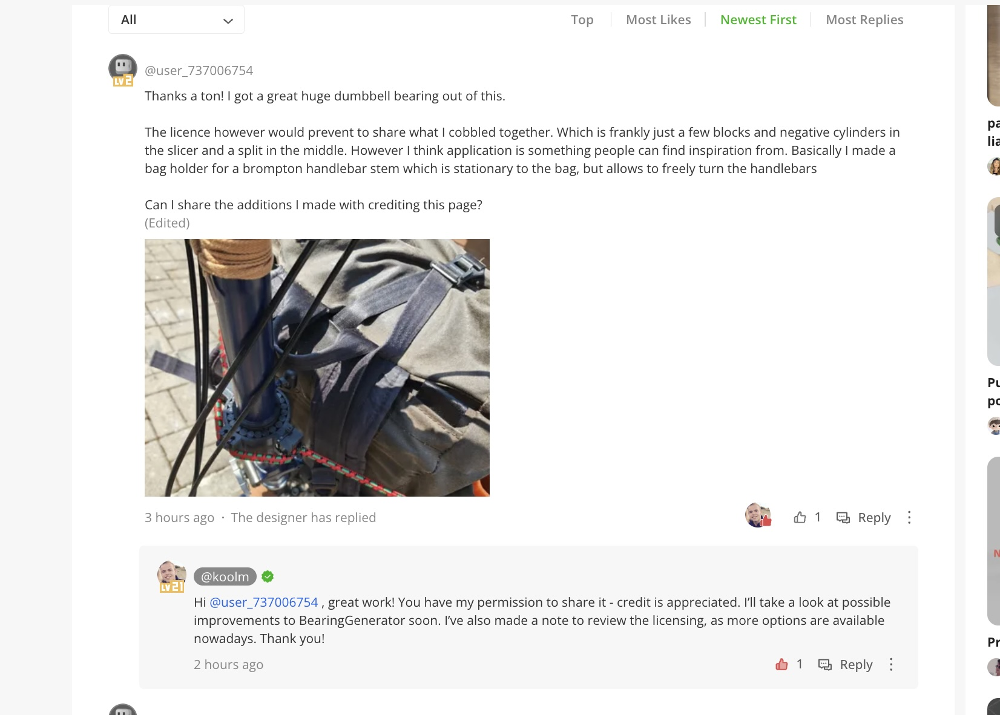
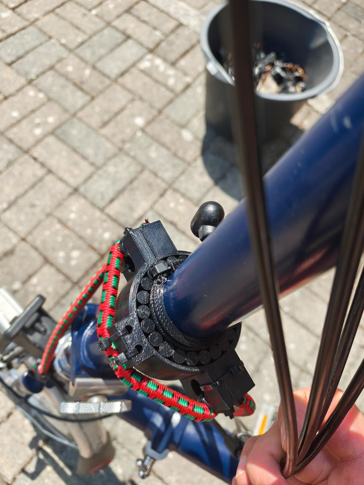
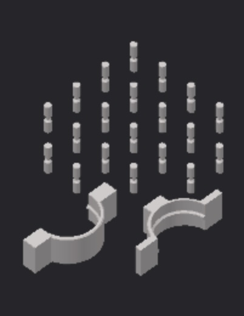
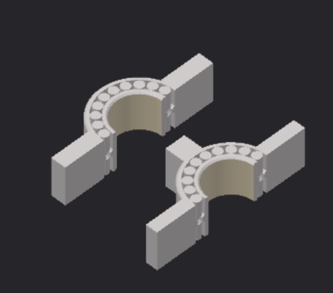
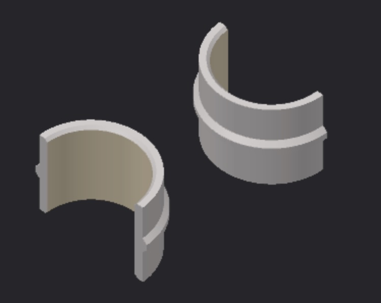
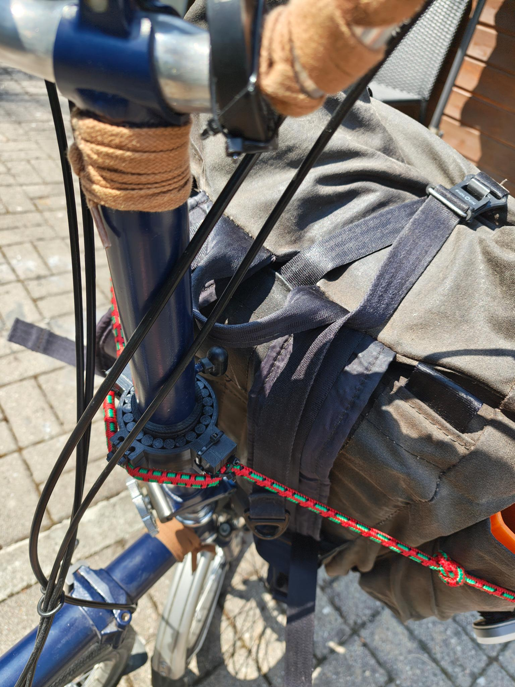
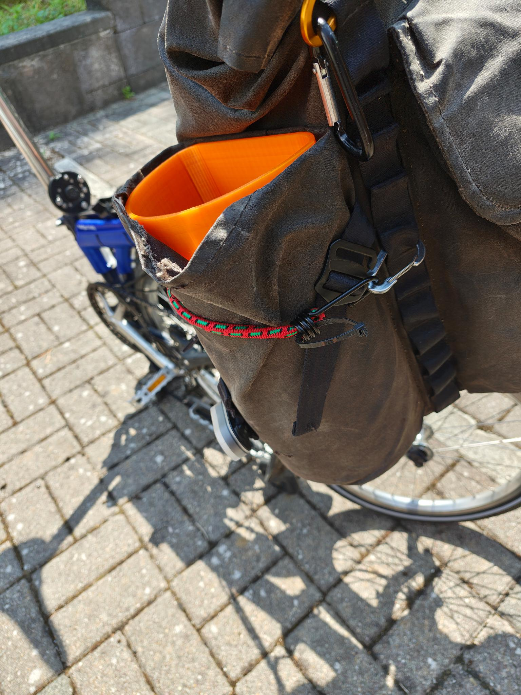

# Stem Bag Holder

A stem/handlebar bag is normally only held up by straps around the head tube, which lets it sag or swing. This part adds a second support: a collar clamped around the bike's stem, with printed tabs that bungee cords loop through to tie the bag down and reduce wobble.

The stem turns with the handlebars during steering, so the collar can't just grip it rigidly — a printed [dumbbell/ball bearing](pics/slicer-exploded-1.jpg) is embedded in the collar, letting the outer clamp stay fixed to the frame while the inner ring rotates freely with the stem.

This is an OrcaSlicer edit based on: [Bearing Generator - Parametric Ball Bearings](https://makerworld.com/en/models/1083205-bearing-generator-parametric-ball-bearings#profileId-1075444) on MakerWorld.

> **Sharing status:** the bearing generator's Standard Digital File License normally prohibits sharing derivative files. I asked the designer directly and they granted permission to share (credit appreciated) — see screenshot below. The `.3mf` files are included in this folder. See [LICENSE](LICENSE) for the terms that apply here — they're **not** the same as the rest of the repo (non-commercial, attribution required), since I can't grant more than the designer granted me.

**Files:**
- `dumbbell Bearing Generator.3mf` — full bearing/collar model
- `dumbbell Bearing Generator-inner-ring.3mf` — inner ring only

## 3D Modelling & Printing 

**How the bearing was generated (if you want to reproduce/adjust it yourself):**

1. On the [MakerWorld model page](https://makerworld.com/en/models/1083205-bearing-generator-parametric-ball-bearings#profileId-1075444), open **Customize**.
2. Under **Bearing → Type**, select **Custom**.
3. Set **Ball** to **Dumbbell**.
4. Under the **Custom** tab, set:
   - Inner Diameter: `35.2`
   - Outer Diameter: `62.0`
   - Width: `30.0`
   - Spacing: `0.05`
   - Clearance: `0.15`
   - Chamfer: `0.6`
5. Click **Generate**, then export/download the model and import it into OrcaSlicer or Bambu Studio (menu paths below match OrcaSlicer 2.x / Bambu Studio — layouts are nearly identical between the two; slightly different wording in other versions).

**Slicer edits (OrcaSlicer / Bambu Studio):**

1. **Split the bearing into its parts.** Right-click the model in the 3D view (or in the object list on the right) → **Split to objects**. This separates the outer ring, inner ring, and balls into independent objects.
2. **Cut each ring in half.** Select the outer ring → click the **Cut** tool in the left toolbar (box icon with dashed line / knife icon, shortcut `C`). Drag the cutting plane to 90 degrees, make sure **"Place on cut"** is off if you want both halves kept separately, then confirm. Repeat for the inner ring.
3. **Add the mounting blocks.** Right-click empty space on the build plate → **Add primitive → Cube**. Use the **Move**/**Scale**/**Rotate** tools (left toolbar) to position one block at the 3 o'clock, one at 6 o'clock, and one at 9 o'clock position around the outer ring half, flush against the ring wall.
4. **Punch the zip-tie and bungee holes.** For each hole:
   - Right-click empty space → **Add primitive → Cylinder**, size and position it where the hole should go.
   - In the object list, right-click that cylinder sub-part → set its type to **Negative part** (this subtracts it from the block it overlaps instead of printing as solid).
   - 3 and 9 o'clock blocks: one negative cylinder (zip tie) plus a half-cylinder shape (bungee guide groove) cut into the outer face — model the half-cylinder as a cylinder primitive sunk halfway into the block, also set to **Negative part**.
   - 6 o'clock block: same half-cylinder bungee guide (block made smaller), plus two negative cylinders — one through the top, one through the bottom — for a zip tie to clamp the bungee in place.
5. **Assign the inner ring's material.** Since the inner ring is a separate object, select it in the object list and use the small filament/extruder dropdown next to its name to assign it to your TPU 95A filament slot (outer collar keeps the default/PETG slot). This is what "painting a color" onto an object does in the object list — it's really an extruder assignment, not a cosmetic color.
6. Arrange, slice, and print as usual.

**Print notes:**
- Outer collar (PETG shell) + inner ring facing the stem (TPU 95A) — the softer TPU protects the stem finish and cushions the bearing action.
- 5 walls / gyroid infill 25%
- I split it into 2 STLs, so the multimaterial print for the inner ring is OK
- This is too large for printing in place

**Good Enough vs. Nice:**
- It is currently held by zip ties. Insets for screws would be nice.
- It is a simple slicer edit. Nice would be a 3D model that has the right angles and attachments for the bungee cord — also to prevent snagging of the cables.
- One could additionally use a strap on the 12 o'clock position to press the bg down
- I should add a race to the inner ring with TPU, so one can ziptie the innerring into its vertical position

## Assembly
Here is how I assembled version one

- Sand Down Inner Ring
- Super Glue Inner Ring around the stem about 30mm below handlebar catch
- Bring stem in horizontal position
- zip tie Outer Ring on one side 
- Fill the bearing (This is fiddely)
- Zip Tie the second side

## Gallery

| | |
|---|---|
|  |  |
|  |  |
|  |  |

## License

See [LICENSE](LICENSE) — the bearing model is shared under the designer's permission (credit required, non-commercial), which is stricter than the CC0 license used for the rest of this repo.
